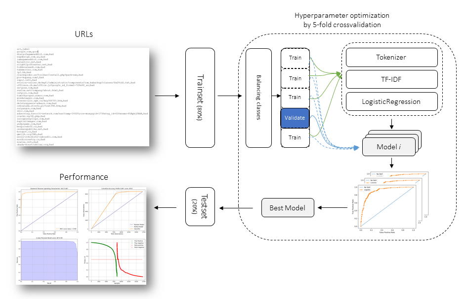

shampoo's documentation!
========================

.. table:: Schematic overview
   :align: center

   +----------+
   | |fig1|   |
   +----------+

-----------------------------------

|python| |pypi| |docs| |stars| |LOC| |downloads_month| |downloads_total| |license| |forks| |open issues| |project status| |medium| |colab| |DOI| |repo-size|

*shampoo* is a Python package for ...

.. tip::
	`Medium Blog: Creating beautiful stand-alone interactive D3 charts with Python <https://towardsdatascience.com/creating-beautiful-stand-alone-interactive-d3-charts-with-python-804117cb95a7>`_

Github
======
Please report bugs, issues and feature extensions at `github <https://github.com/rwsdatalab/shampoo/>`_.

Quick install
=============

.. code-block:: console

   pip install shampoo

Content
=======

.. toctree::
   :maxdepth: 1
   :caption: Background
   
   Abstract

.. toctree::
   :maxdepth: 1
   :caption: Installation
   
   Installation

.. toctree::
  :maxdepth: 1
  :caption: Methods

  Algorithm
  Cross validation and hyperparameter tuning
  Performance
  Save and Load

.. toctree::
  :maxdepth: 1
  :caption: Examples

  Examples

.. toctree::
  :maxdepth: 1
  :caption: Documentation
  
  Documentation
  Coding quality
  shampoo.shampoo

Indices and tables
==================

* :ref:`genindex`
* :ref:`modindex`
* :ref:`search`

.. |python| image:: https://img.shields.io/pypi/pyversions/shampoo.svg
    :alt: |Python
    :target: https://rwsdatalab.github.io/shampoo/

.. |pypi| image:: https://img.shields.io/pypi/v/shampoo.svg
    :alt: |Python Version
    :target: https://pypi.org/project/shampoo/

.. |docs| image:: https://img.shields.io/badge/Sphinx-Docs-blue.svg
    :alt: Sphinx documentation
    :target: https://rwsdatalab.github.io/shampoo/

.. |stars| image:: https://img.shields.io/github/stars/rwsdatalab/shampoo
    :alt: Stars
    :target: https://img.shields.io/github/stars/rwsdatalab/shampoo

.. |LOC| image:: https://sloc.xyz/github/rwsdatalab/shampoo/?category=code
    :alt: lines of code
    :target: https://github.com/rwsdatalab/shampoo

.. |downloads_month| image:: https://static.pepy.tech/personalized-badge/shampoo?period=month&units=international_system&left_color=grey&right_color=brightgreen&left_text=PyPI%20downloads/month
    :alt: Downloads per month
    :target: https://pepy.tech/project/shampoo

.. |downloads_total| image:: https://static.pepy.tech/personalized-badge/shampoo?period=total&units=international_system&left_color=grey&right_color=brightgreen&left_text=Downloads
    :alt: Downloads in total
    :target: https://pepy.tech/project/shampoo

.. |license| image:: https://img.shields.io/badge/license-MIT-green.svg
    :alt: License
    :target: https://github.com/rwsdatalab/shampoo/blob/master/LICENSE

.. |forks| image:: https://img.shields.io/github/forks/rwsdatalab/shampoo.svg
    :alt: Github Forks
    :target: https://github.com/rwsdatalab/shampoo/network

.. |open issues| image:: https://img.shields.io/github/issues/rwsdatalab/shampoo.svg
    :alt: Open Issues
    :target: https://github.com/rwsdatalab/shampoo/issues

.. |project status| image:: http://www.repostatus.org/badges/latest/active.svg
    :alt: Project Status
    :target: http://www.repostatus.org/#active

.. |medium| image:: https://img.shields.io/badge/Medium-Blog-green.svg
    :alt: Medium Blog
    :target: https://rwsdatalab.github.io/shampoo/pages/html/Documentation.html#medium-blog

.. |colab| image:: https://colab.research.google.com/assets/colab-badge.svg
    :alt: Colab example
    :target: https://rwsdatalab.github.io/shampoo/pages/html/Documentation.html#colab-notebook

.. |DOI| image:: https://zenodo.org/badge/246504758.svg
    :alt: Cite
    :target: https://zenodo.org/badge/latestdoi/246504758

.. |repo-size| image:: https://img.shields.io/github/repo-size/rwsdatalab/shampoo
    :alt: repo-size
    :target: https://img.shields.io/github/repo-size/rwsdatalab/shampoo
